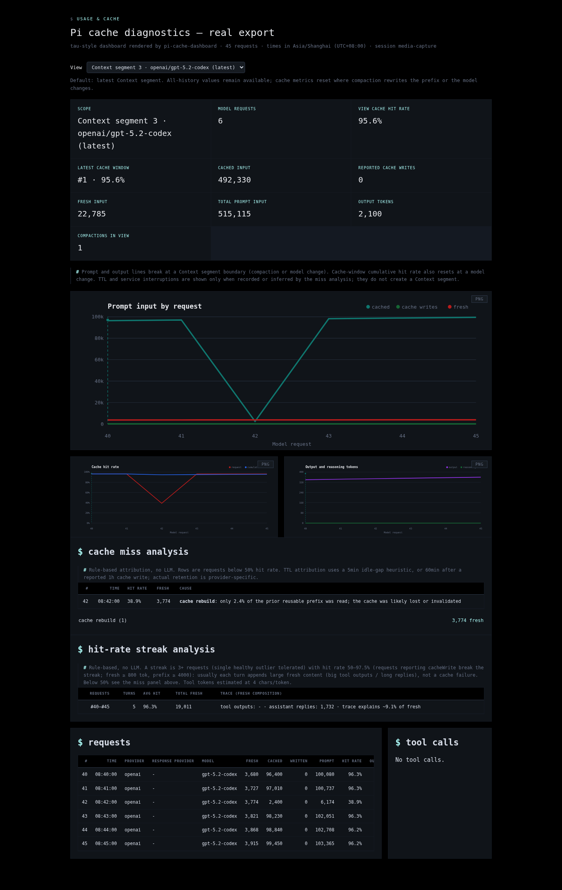
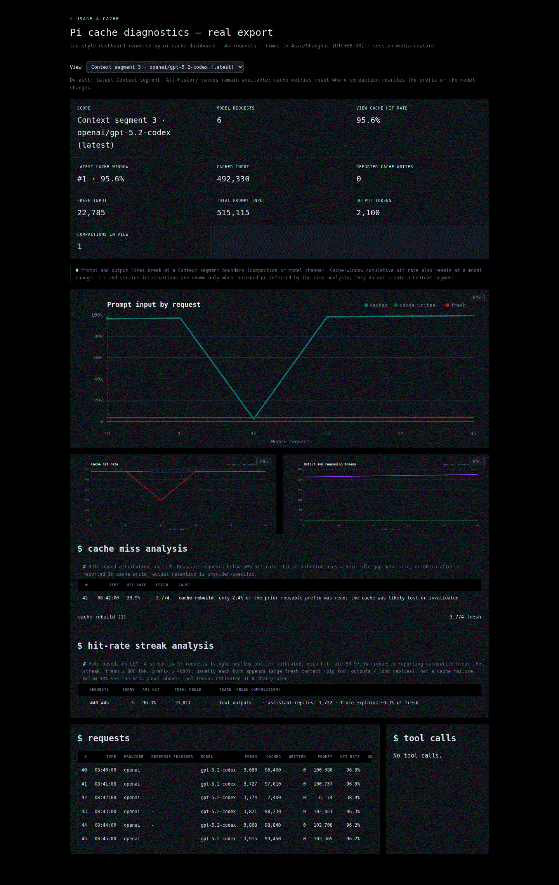

# @maxiaochao/pi-cache-export

Pi 的 `/cache_export [path]` 扩展，把当前会话写成可交互的缓存诊断 HTML。



## 为什么有这个包

这个功能对齐 [Hugging Face Tau](https://github.com/huggingface/tau) coding agent 的 session usage / cache dashboard。`src/tau-assets.ts` 与仪表盘基础逻辑来自 Tau 的 `tau_coding/session_usage.py`，本包把它适配到 Pi session，并增加：

- Pi 消息、tool result、模型切换和 compaction 解析。
- 按 Context segment 查看最新上下文、历史 segment 或全部历史。
- cache miss、TTL expiry、cache rebuild 和低命中 streak 诊断。
- 跨图表断点的 tooltip，以及 segment 内的全局请求编号。

Tau 资产保持上游一致；上述 Pi 语义和诊断规则由本包维护。

## 演示



```text
/cache_export
/cache_export ./reports/cache.html
/cache_export --open
```

命令读取当前 session，生成自包含 HTML；`--open` 在支持的桌面环境中同时打开浏览器。

## 安装

完整工具包已经包含本扩展：

```bash
pi install npm:@maxiaochao/pi-toolkit
```

只需要缓存仪表盘时单独安装：

```bash
pi install npm:@maxiaochao/pi-cache-export
```

两种方式二选一，避免重复注册。

## 更新

```bash
pi update npm:@maxiaochao/pi-toolkit       # 更新主包内置版本
pi update npm:@maxiaochao/pi-cache-export  # 更新独立子包
```

两个 npm 包版本独立。Cache Export 源码变更需要分别发布主包和子包，才能覆盖两类用户。

## 功能

- 默认展示最新 Context segment，也可切换历史 segment 或全部历史。
- 模型切换和 compaction 切分 segment。
- 诊断 cache miss、TTL、cache rebuild 和低命中 streak。
- 导出的 HTML 自包含，可离线查看。

## 开发与测试

权威源码位于 `extensions/` 和 `src/`。`src/tau-assets.ts` 必须由上游资产重生成，禁止手改。测试流程、数据用例和结果见 [TESTING.md](TESTING.md)。

```bash
npm --prefix packages/cache-export test
npm --prefix packages/cache-export run load-test
npm pack ./packages/cache-export --dry-run
```
