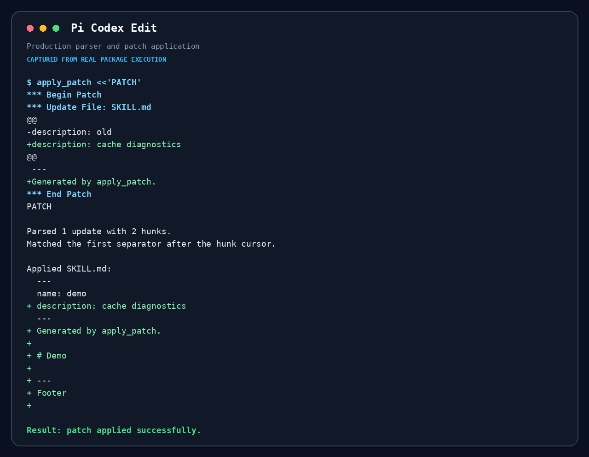
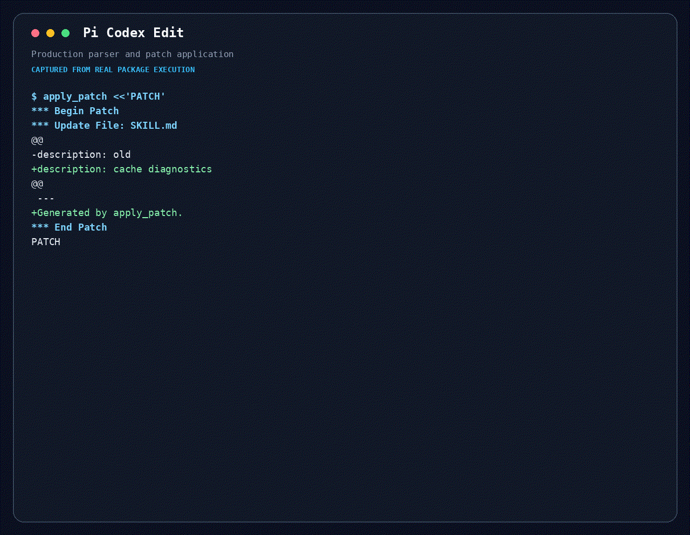

# Codex Edit (apply_patch)

A Pi extension that gives selected GPT models the same `apply_patch` editing protocol used by the Codex harness, while every model outside the routing rules keeps Pi's native `edit` tool.



## Why this package exists

GPT models used through the Codex harness are trained to edit with OpenAI's `apply_patch` protocol, while Pi's native editor uses a different `oldText/newText` contract. This package exposes the Codex-harness editing interface inside Pi for explicitly allowed models. Models that do not match the rules continue to see Pi's native `edit`; the extension never replaces the editor universally.

The implementation follows Codex's ordered hunk matching semantics and supports the same Add/Delete/Update/Move patch shape, then adds workspace, symlink, overwrite, preflight, and mutation-queue safeguards required by Pi.

## Demo



```text
*** Begin Patch
*** Update File: src/app.ts
@@
-const enabled = false;
+const enabled = true;
*** End Patch
```

The complete patch is parsed and preflighted before any file is mutated; the result reports per-file diffs and committed paths.

## Install

Install it as a separate package:

```bash
pi install npm:@maxiaochao/pi-codex-edit
```

This is the standalone child package of `@maxiaochao/pi-toolkit`. The full toolkit already bundles the same implementation, so install this package only when you do not want the rest of the toolkit. Installing both is unnecessary and may register `apply_patch` twice.

Update whichever distribution you installed:

```bash
pi update npm:@maxiaochao/pi-toolkit     # full toolkit, including bundled Codex Edit
pi update npm:@maxiaochao/pi-codex-edit  # standalone child package
```

The two npm packages have independent versions. An implementation or configuration change reaches toolkit users only after a new `@maxiaochao/pi-toolkit` version is published, and reaches standalone users only after a new `@maxiaochao/pi-codex-edit` version is published.

The extension registers `apply_patch` and selects the editing tool from the resolved model configuration:

- Allowed model ID on a supported Responses API: Codex-harness-compatible `apply_patch`
- Model ID outside the allowlist: Pi's native `edit`
- Model on another API, even if its ID matches: Pi's native `edit`

The default allowlist enables all `gpt-5.6-*` models regardless of provider. Other model families can be added after separate validation by editing `config.json`.

The extension does not add a permanent AGENTS rule telling models not to use `apply_patch`. Only the selected editor tool is active, so the model receives one editing protocol.

## What `apply_patch` does

The tool accepts raw Codex patch text between `*** Begin Patch` and `*** End Patch`. It supports:

- `Add File`
- `Delete File`
- `Update File`
- `Move to`
- multiple update hunks with `@@` context
- EOF-oriented insertions

Before writing, it parses the complete patch, resolves paths, rejects workspace escapes and unsafe symlink/parent paths, reads all source files, and computes every update in memory. Only after preflight succeeds does it mutate files. It returns per-file diff details and reports committed paths if a later filesystem operation fails.

## Configuration

The extension defaults to a model-ID allowlist in `config.json`: `"gpt-5.6-*"`. Provider does not affect routing. Each entry is a `*` glob, so this matches every `gpt-5.6-` variant. The route additionally requires:

```text
model.api = openai-responses or openai-codex-responses
```

The effective routing rule is:

```text
settings.enabled
and model.api in ["openai-responses", "openai-codex-responses"]
and model.id matches at least one settings.models pattern
```

Patterns are case-sensitive, match the complete model ID, and support `*` as the wildcard. Provider name is intentionally ignored.

### Add model rules

Edit `config.json` and add validated model-ID patterns:

```json
{
  "enabled": true,
  "models": [
    "gpt-5.6-*",
    "gpt-5.7-*",
    "my-codex-model"
  ]
}
```

Examples:

| Pattern | Matches | Does not match |
|---|---|---|
| `gpt-5.6-*` | `gpt-5.6-sol`, `gpt-5.6-terra` | `gpt-5.7-sol` |
| `gpt-*-codex` | `gpt-5.6-codex` | `gpt-5.6-codex-mini` |
| `my-codex-model` | exactly `my-codex-model` | `my-codex-model-v2` |

Adding a pattern only changes routing; it does not prove that a model handles the Codex protocol correctly. Validate the model before adding it to the default allowlist. A matching model on `anthropic-messages`, `openai-completions`, or another unsupported API still uses Pi's native `edit`.

Grammar support is not part of the route. When a provider does not emit Lark grammar tools, Pi falls back to a normal function tool, so `apply_patch` still runs there — only the grammar-enforced output shape is lost.

Edit `config.json` in the standalone installed package, or `packages/codex-edit/config.json` inside an installed full toolkit, only if you need to change the default allowlist. Package updates can replace local edits. Set `"enabled": false` to disable all `apply_patch` routing. The implementation keeps both tools registered for session replay and changes only the active tool set on `session_start` and `model_select`.

## Documentation

- `summary.md`: benchmark summary and decision record.
- `codex-edit-explainer.html`: self-contained interactive architecture and configuration explainer.
- `TESTING.md`: deterministic test flow, regression fixtures, and latest baseline.

The benchmark found equal final correctness in the fair 20-case comparison, with first editor-call success improving from 85% to 95%. Overall tool-call count and cache-inclusive token use were effectively unchanged, so the route stays limited to the GPT/Codex allowlist rather than replacing `edit` universally.
