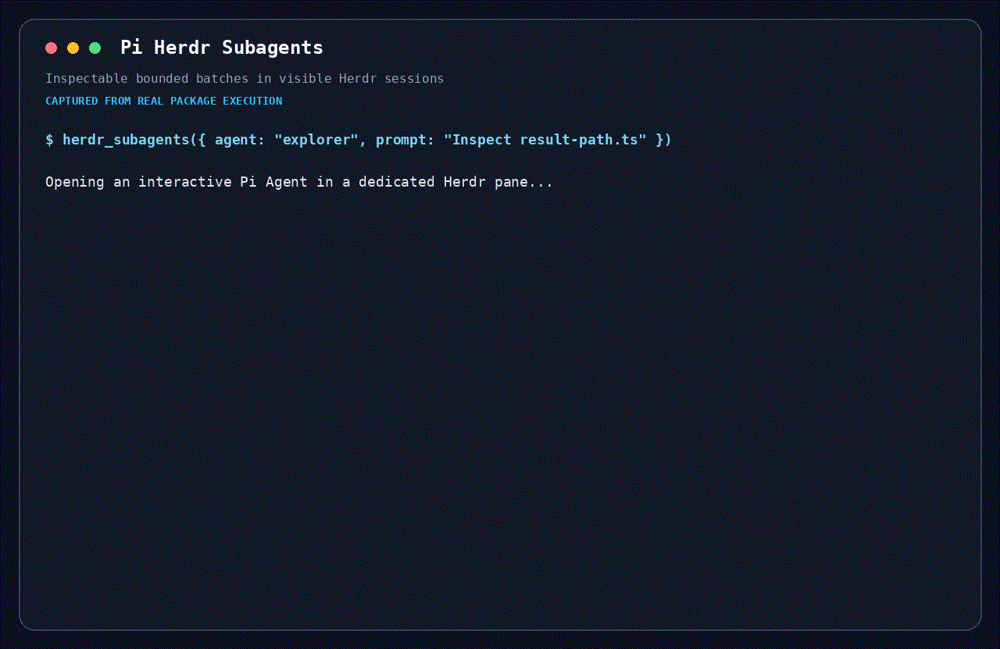

# @maxiaochao/pi-herdr-subagents

A Pi extension that runs focused foreground or background work as normal interactive Pi Agents in visible Herdr panes. Full answers and sessions stay in project-local records while the parent receives only concise summaries and document paths.


## Demo



## Requirements and install

Run Pi inside Herdr, then install the package:

```bash
pi install npm:@maxiaochao/pi-herdr-subagents
```

Update an existing standalone installation with:

```bash
pi update npm:@maxiaochao/pi-herdr-subagents
```

The full `@maxiaochao/pi-toolkit` package also bundles this extension. Install the full toolkit or this standalone child package, not both.

Inside a Herdr workspace, the package registers `herdr_subagents` and `/herdr-subagents`. Outside Herdr (or without a workspace ID), the extension registers neither, so the tool is absent from the model context. Start Pi inside Herdr or reload the extension there to enable them.

The design replaces hidden print-mode subprocesses with ordinary interactive Pi Agents managed through Herdr, so delegated work stays visible, inspectable, resumable, and durably recorded.

## Usage

Discover the effective personas first:

```text
herdr_subagents({ action: "list" })
```

Then run one self-contained task:

```text
herdr_subagents({
  agent: "worker",
  label: "auth-review",
  prompt: "Inspect the authentication flow and summarize the risks"
})
```

Or submit an ordered foreground batch:

```text
herdr_subagents({
  label: "security-review",
  concurrency: 3,
  tasks: [
    { name: "auth", agent: "reviewer", prompt: "Review authentication" },
    { name: "sessions", agent: "explorer", prompt: "Trace session storage" }
  ]
})
```

Set `background: true` to return a stable run ID immediately while the queue continues. One run is dispatched at a time by an extension instance; later runs remain queued and start FIFO. Each background run sends one compact parent notification only when the whole run completes, partially fails, fails, or blocks. Individual successful tasks do not wake the parent model.

A child missing required information reports `needs-input` with an exact question. The run becomes blocked, keeps its Herdr tab, pane, partial report, and Pi session, and returns control to the parent. Answer through the same tool to continue the original session:

```text
herdr_subagents({ action: "respond", runId: "<run-id>", answer: "Use the main branch." })
```

While a batch is active, its task rows stay below the editor. With an empty editor, press `↓` to enter the list, `↑`/`↓` to choose a task, `Enter` to focus its exact pane, and `Esc` to return. `/herdr-subagents focus <task-number>` remains available as a fallback.

## History

Run `/herdr-subagents history` or `herdr_subagents({ action: "history" })` to list compact project-local run and task reports after Herdr tabs close. Full results, described documents, artifacts, and persistent Pi sessions remain separate on disk and are not loaded into parent context.

Continue a saved conversation in a new Herdr tab with `herdr_subagents({ action: "resume", runId: "<run-id>", task: 1, prompt: "Follow up..." })`. Remove only a selected archive with `herdr_subagents({ action: "cleanup", runId: "<run-id>" })`. History has no automatic count-based eviction. The extension adds the runtime path to local Git excludes when available (and otherwise uses `.pi/.gitignore`) without overwriting unrelated rules.

Read-only tasks start FIFO up to the configured concurrency limit. A pane is created only when its task starts, belongs exclusively to that task, and is never reused. Completed panes remain inspectable while another task in the batch is unsettled. Results remain in input order, and one failed task does not cancel its siblings. Any batch containing a write-capable persona is forced to concurrency one.

The widget shows one row per queued, running, blocked, failed, or completed task. Answering a blocked task refreshes rows and pane IDs as that task resumes and queued siblings start. Completed rows remain selectable until the whole batch settles. `/herdr-subagents active` shows the same compact state. Native labels stay short: `SA · <batch>` for the tab and `<order> · <task>` for each pane. When all tasks settle, the tab closes immediately if unfocused or after the user leaves it; a deferred close failure is persisted and shown as a warning.

Foreground calls block until all children report completion, failure, or a request for input. Every child is started with Herdr's Agent lifecycle as a normal Pi TUI and prompted with wait semantics; no print-mode command or completion marker is injected into the pane.

## Reports and records

The child must finish through the package's structured `subagent_report` tool. The parent receives only:

- completion or failure status
- a concise summary
- paths to useful documents
- the task-record location

The complete result is not copied into the parent model context. Each run is retained under:

```text
.pi/herdr-subagents/runs/<run>/tasks/<task>/
```

The task directory contains the full result, structured report, task metadata, system prompt, and persistent Pi session. Run-level metadata is stored in the parent run directory.

## Personas

The package includes `worker` (write access), `explorer` (read access), and `reviewer` (read access). Persona definitions are discovered in this order, with the first available higher-precedence definition replacing the lower one:

1. `.pi/herdr-subagents/agents/*.md` in the project
2. `~/.pi/agent/herdr-subagents/agents/*.md` globally
3. this package's `agents/*.md`

A custom persona without `access` is treated as write-capable. Definitions may set `access`, `model`, `thinking`, `tools`, and `skills` in frontmatter.

The default `agents/worker.md` uses this format:

```md
---
name: worker
description: General-purpose worker for one focused task
tools: read, bash, edit, write, grep, find, ls
---

You are a focused worker subagent.
```

Supported frontmatter:

- `name` and `description` are required.
- `model` optionally selects a child model. A call-level `model` overrides it; otherwise the current session model is inherited.
- `tools` optionally restricts built-in tools. `subagent_report` is always added so the child can settle the task.
- `access` is `read` or `write`; omitted custom values default to `write`.
- `thinking` and `skills` provide persona defaults.

Global settings live at `~/.pi/agent/herdr-subagents.json`; project overrides live at `.pi/herdr-subagents.json`. Both support `defaultConcurrency`, `maxConcurrency`, `stalledWarningSeconds`, `defaultModel`, and a `personas` object whose entries can override `model`, `thinking`, and `skills`.

```json
{
  "defaultModel": "provider/model",
  "maxConcurrency": 3,
  "personas": {
    "reviewer": { "thinking": "high", "skills": ["code-review"] }
  }
}
```

Project values override global values recursively. Model resolution is: task override, project persona setting, global persona setting, persona frontmatter, global/project default model, then parent model. Run `/herdr-subagents agents`, `/herdr-subagents models`, or `/herdr-subagents settings` to inspect effective values and their sources.

## Recovery and failures

Queued background submissions are persisted before dispatch. Closing the parent Pi session cancels queued, running, and blocked work, records `cancelled`, and closes the owned run tab. On the next Pi start, stale active records and queued submissions from a prior parent session are reconciled to a terminal state, including when Pi reused the same process, and leaked tabs are cleaned up when possible. Missing, truncated, or structurally invalid child reports become explicit failures or cancellation diagnostics; recovery errors are reported without leaving new submissions paused.

Tab, pane, and child startup commands are not automatically retried: an error may arrive after Herdr already created the resource. A failure after prompt submission is preserved and never automatically rerun. Historical follow-ups exclude concurrent resumes of the same run with an atomic `.resume.lock` directory; if Pi crashes without releasing it, confirm no Agent is still using that run before removing the lock manually. `stalledWarningSeconds` emits a warning without killing long-running work. Run/task/report snapshots use atomic replacement so interruption cannot expose half-written JSON.

The child does not inherit parent extensions, parent conversation, or unconfigured skills, but normal project context files still apply. It uses the same Pi installation, provider configuration, model catalog, and credentials as the parent.

## Development and tests

See [TESTING.md](TESTING.md) for deterministic tests, extension loading, packaging, and real Herdr smoke requirements.
