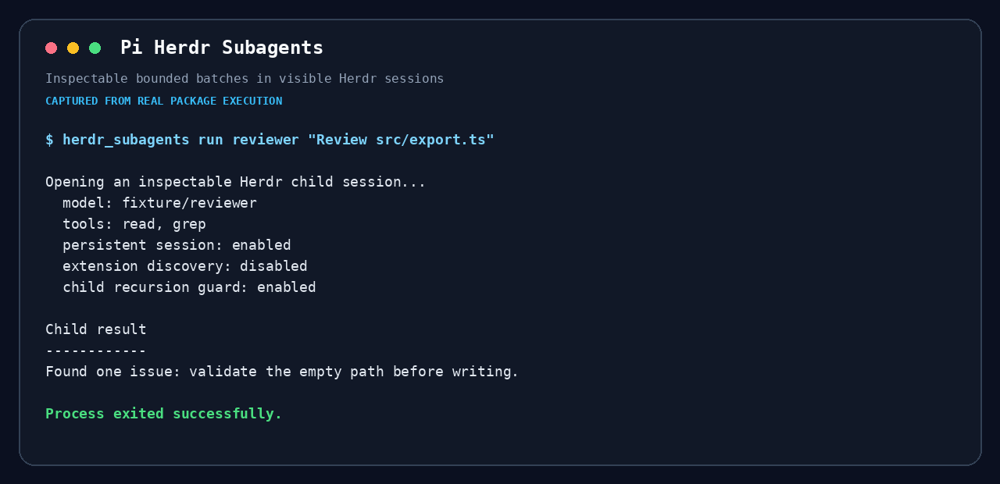

# @maxiaochao/pi-herdr-subagents

A Pi extension that runs focused foreground or background work as normal interactive Pi Agents in visible Herdr panes. Full answers and sessions stay in project-local records while the parent receives only concise summaries and document paths.



## Demo

The recording shows a real Pi conversation invoking a three-task read-only batch, the active Fleet footer in the parent, Herdr opening one interactive Agent pane per task, and the compact results returning to the parent.

https://github.com/user-attachments/assets/8ddf3ae6-a11a-492b-9cae-d9496ba65b67

The video starts a three-agent batch, focuses each live child pane in turn, captures the parent Fleet footer with yellow running indicators and true usage, then returns to the parent summary. Completed Fleet rows use green indicators. The reproducible source recording is retained as [`docs/demo.webm`](docs/demo.webm).

## Requirements and install

Run Pi inside Herdr, then install the package:

```bash
pi install npm:@maxiaochao/pi-herdr-subagents
```

Update an existing standalone installation with:

```bash
pi update npm:@maxiaochao/pi-herdr-subagents
```

The full `@maxiaochao/pi-toolkit` package also bundles this extension. Install the full toolkit or this standalone child package, not both.

Inside a Herdr workspace, the package registers `herdr_subagents`, `herdr_subagents_control`, and `/herdr-subagents`. Outside Herdr (or without a workspace ID), the extension registers none of them, so these capabilities are absent from the model context. Start Pi inside Herdr or reload the extension there to enable them.

The design replaces hidden print-mode subprocesses with ordinary interactive Pi Agents managed through Herdr, so delegated work stays visible, inspectable, resumable, and durably recorded.

## Usage

Discover the effective personas first:

```text
herdr_subagents_control({ action: "list" })
```

Then run one self-contained task:

```text
herdr_subagents({
  label: "auth-review",
  tasks: [
    { name: "auth", agent: "worker", prompt: "Inspect the authentication flow and summarize the risks" }
  ]
})
```

Or submit an ordered foreground batch:

```text
herdr_subagents({
  label: "security-review",
  concurrency: 3,
  tasks: [
    { name: "auth", agent: "reviewer", prompt: "Review authentication" },
    { name: "sessions", agent: "explorer", prompt: "Trace session storage" }
  ]
})
```

`tasks` is always a non-empty array: one item is a single task and multiple items form a batch. Set `background: true` for either form to return a stable run ID immediately while the queue continues. One run is dispatched at a time by an extension instance; later runs remain queued and start FIFO. Each background run sends one compact parent notification only when the whole run completes, partially fails, fails, or blocks. Individual successful tasks do not wake the parent model.

A child missing required information reports `needs-input` with an exact question. The run becomes blocked, keeps its Herdr tab, pane, partial report, and Pi session, and returns control to the parent. Answer through the control tool to continue the original session:

```text
herdr_subagents_control({ action: "respond", runId: "<run-id>", answer: "Use the main branch." })
```

Cancel one active or queued run with `herdr_subagents_control({ action: "cancel", runId: "<run-id>" })`. Cancellation aborts its live child prompts, archives active or queued tasks as cancelled, closes its run tab, and leaves unrelated runs alone.

While a batch is active, a compact Fleet monitor stays below the editor. Its divider/title row summarizes the run, and each task row shows a hollow or filled status circle, the real persona and task name, status, live active duration, and cumulative child Pi token usage in one compact shared metrics column after the longest row rather than at the terminal edge. Running work uses Pi's warning/yellow semantic color and completed work uses success/green. Token totals use the child session's persisted assistant, tool-result, standalone usage, compaction, and branch-summary usage; they are never estimated. Queued tasks show neither fabricated time nor tokens. The monitor follows Pi theme semantics, truncates by visible terminal columns, and refreshes session usage from both file events and the running one-second timer.

With an empty editor, press `↓` to enter the list, `↑`/`↓` to choose a task, `Enter` to focus its exact pane, and `Esc` to return. `/herdr-subagents focus <task-number>` remains available as a fallback.

## History

Run `/herdr-subagents history` or `herdr_subagents_control({ action: "history" })` to list compact project-local run and task reports after Herdr tabs close. Full results, described documents, artifacts, and persistent Pi sessions remain separate on disk and are not loaded into parent context.

Continue a saved conversation in a new Herdr tab with `herdr_subagents_control({ action: "resume", runId: "<run-id>", task: 1, prompt: "Follow up..." })`. Remove only a selected archive with `herdr_subagents_control({ action: "cleanup", runId: "<run-id>" })`. History has no automatic count-based eviction. The extension adds the runtime path to local Git excludes when available (and otherwise uses `.pi/.gitignore`) without overwriting unrelated rules.

Read-only tasks start FIFO up to the configured concurrency limit. A pane is created only when its task starts, belongs exclusively to that task, and is never reused. Completed panes remain inspectable while another task in the batch is unsettled. Results remain in input order, and one failed task does not cancel its siblings. Any batch containing a write-capable persona is forced to concurrency one.

The widget shows one row per queued, running, blocked, failed, or completed task. Answering a blocked task or resuming saved history refreshes authoritative persona, timing, session, status, and pane projections as work advances. Active duration accumulates only while the task is running, excluding time spent queued or waiting for an answer. Completed rows remain selectable until the whole batch settles. `/herdr-subagents active` shows the same compact state. Native labels stay short: `SA · <batch>` for the tab and `<order> · <task>` for each pane. When all tasks settle, the tab closes immediately if unfocused or after the user leaves it; a deferred close failure is persisted and shown as a warning. An already-missing tab is treated as successfully cleaned, so retries are idempotent.

Foreground calls block until all children report completion, failure, or a request for input. Every child is started with Herdr's Agent lifecycle as a normal Pi TUI and prompted with wait semantics; no print-mode command or completion marker is injected into the pane.

## Reports and records

The child must finish through the package's structured `subagent_report` tool. The parent receives only:

- completion or failure status
- a concise summary
- paths to useful documents
- the task-record location

The complete result is not copied into the parent model context. Each run is retained under:

```text
.pi/herdr-subagents/runs/<run>/tasks/<task>/
```

The task directory contains the full result, structured report, task metadata, system prompt, and persistent Pi session. Run-level metadata is stored in the parent run directory.

## Configuration and personas

Herdr Subagents loads settings and persona definitions from separate files:

| Scope | Settings | Persona definitions |
| --- | --- | --- |
| Project | `.pi/herdr-subagents.json` | `.pi/herdr-subagents/agents/*.md` |
| Global | `~/.pi/agent/herdr-subagents.json` | `~/.pi/agent/herdr-subagents/agents/*.md` |
| Package | built-in defaults | installed package `agents/*.md` |

Project JSON values recursively override global JSON values. The built-in setting defaults are `defaultConcurrency: 1`, `maxConcurrency: 4`, and `stalledWarningSeconds: 300`. `defaultModel` and `defaultThinking` are unset, so the parent Pi model and its thinking level are inherited unless another setting wins.

### Settings file option reference

These are all supported top-level fields in `herdr-subagents.json`:

| Option | Accepted value | Default | Effect |
| --- | --- | --- | --- |
| `defaultConcurrency` | Positive integer | `1` | Number of read-only tasks allowed to run together when a batch call omits `concurrency`. It is capped to `maxConcurrency`. |
| `maxConcurrency` | Positive integer | `4` | Hard ceiling for requested/default batch concurrency. A batch containing any write-capable persona still runs serially. |
| `stalledWarningSeconds` | Positive integer | `300` | Seconds before a still-running child emits a warning. This is not a timeout and does not stop the child. |
| `defaultModel` | Non-empty Pi model string, normally `provider/model` | Unset | Model used when neither JSON persona settings nor persona Markdown select one. If unset, the parent model is inherited. Use `/herdr-subagents models` to list authenticated models. |
| `defaultThinking` | `off`, `minimal`, `low`, `medium`, `high`, `xhigh`, or `max` | Unset | Thinking level below persona-specific settings. Provider/model support can vary. If unset, parent thinking is inherited only when the parent model is also inherited. |
| `personas` | Object keyed by an existing persona name | `{}` | Per-persona JSON overrides described below. This does not create a persona; a matching Markdown definition must exist. |

Known fields with an invalid JSON type, an empty required string, or a non-positive integer are ignored with a diagnostic shown by `/herdr-subagents settings`. Model IDs, thinking-level compatibility, and skill availability are ultimately validated by Pi when the child starts. When `defaultConcurrency` exceeds `maxConcurrency`, the effective default is reduced to the maximum.

Each `personas.<name>` object supports exactly these overrides:

| Option | Accepted value | Effect |
| --- | --- | --- |
| `model` | Non-empty Pi model string | Overrides the model from the effective persona Markdown and `defaultModel`. |
| `thinking` | `off`, `minimal`, `low`, `medium`, `high`, `xhigh`, or `max` | Overrides persona Markdown and `defaultThinking`. The value is passed to Pi's `--thinking` option. |
| `skills` | Array of non-empty strings | Replaces the entire lower-precedence skill list. Use `[]` to clear inherited skills. Each item is passed to child Pi as `--skill`. |

JSON persona overrides cannot change `name`, `description`, `access`, `tools`, or the system prompt; define those in persona Markdown.

A global configuration can establish shared defaults:

```json
{
  "defaultConcurrency": 2,
  "maxConcurrency": 4,
  "stalledWarningSeconds": 300,
  "defaultModel": "anthropic/claude-sonnet-4-5",
  "defaultThinking": "medium",
  "personas": {
    "explorer": {
      "model": "anthropic/claude-haiku-4-5",
      "thinking": "medium",
      "skills": ["code-search"]
    },
    "reviewer": {
      "thinking": "high",
      "skills": ["code-review"]
    }
  }
}
```

The project file can override only the fields that differ. Persona fields are merged by persona name:

```json
{
  "defaultConcurrency": 3,
  "stalledWarningSeconds": 600,
  "defaultThinking": "high",
  "personas": {
    "explorer": {
      "model": "openai/gpt-5.2"
    },
    "reviewer": {
      "skills": ["security-review", "code-review"]
    }
  }
}
```

The package includes these personas:

| Persona | Access | Built-in tools | Intended use |
| --- | --- | --- | --- |
| `worker` | write | `read`, `bash`, `edit`, `write`, `grep`, `find`, `ls` | Focused implementation work |
| `explorer` | read | `read`, `bash`, `grep`, `find`, `ls` | Fast codebase investigation |
| `reviewer` | read | `read`, `bash`, `grep`, `find`, `ls` | Correctness and maintainability review |

Persona definitions use Markdown frontmatter followed by the child system prompt. For example, save this as `.pi/herdr-subagents/agents/security-reviewer.md`:

```md
---
name: security-reviewer
description: Read-only reviewer for security risks
access: read
model: anthropic/claude-sonnet-4-5
thinking: high
tools: read, bash, grep, find, ls
skills: security-review, code-review
---

Review the assigned scope without modifying files. Report concrete risks and evidence.
```

Persona Markdown supports these frontmatter fields:

| Field | Accepted value | Required/default | Effect |
| --- | --- | --- | --- |
| `name` | Non-empty string | Required | Persona identifier used by `agent`. Names must be unique within one persona directory. |
| `description` | Non-empty string | Required | Description shown to the parent when agents are listed. |
| `access` | `read` or `write` | `write` | Scheduling declaration. Any batch containing `write` is forced to concurrency one. `read` permits parallel scheduling but does not itself remove tools. |
| `model` | Non-empty Pi model string | Unset | Persona model default. |
| `thinking` | `off`, `minimal`, `low`, `medium`, `high`, `xhigh`, or `max` | Unset | Persona thinking default passed to Pi's `--thinking` option. |
| `tools` | Non-empty comma-separated list, optionally bracketed | Child Pi defaults | Restricts built-in tools. Supported names are `read`, `bash`, `edit`, `write`, `grep`, `find`, `ls`, and `powershell`. `subagent_report` is always added. |
| `skills` | Comma-separated list, optionally bracketed | None | Skills loaded explicitly into child Pi; automatic skill discovery is disabled. |

The Markdown body after the frontmatter is the child system prompt and may be empty. To make a custom persona operationally read-only, set `access: read` **and** choose an appropriate `tools` allowlist; `access` alone is not a tool sandbox. Model names and skill values are passed to Pi, so they must be available in the installed Pi environment.

Persona Markdown definitions use replacement precedence, not field merging. A same-name project definition replaces the entire global or package definition:

1. project `.pi/herdr-subagents/agents/*.md`
2. global `~/.pi/agent/herdr-subagents/agents/*.md`
3. package built-ins

### Model and persona-option precedence

The child model is selected in this exact order:

1. `model` on the task or call
2. project `personas.<name>.model` JSON setting
3. global `personas.<name>.model` JSON setting
4. `model` in the effective persona Markdown frontmatter
5. effective `defaultModel` JSON setting (project overrides global)
6. parent Pi model

The child thinking level is selected in this order:

1. project `personas.<name>.thinking` JSON setting
2. global `personas.<name>.thinking` JSON setting
3. `thinking` in the effective persona Markdown frontmatter
4. effective `defaultThinking` JSON setting (project overrides global)
5. parent Pi thinking level when the child also inherits the parent model

Thinking has no call-level override. `skills` uses the first three persona-level steps and has no global default; a project `skills` array replaces, rather than appends to, the global or Markdown list.

Override the model for one task:

```text
herdr_subagents({
  tasks: [
    { name: "authorization", agent: "reviewer", model: "anthropic/claude-opus-4-1:high", prompt: "Review the authorization boundary" }
  ]
})
```

Each task in a batch can select its own model:

```text
herdr_subagents({
  concurrency: 2,
  tasks: [
    { name: "map", agent: "explorer", model: "anthropic/claude-haiku-4-5", prompt: "Map the request flow" },
    { name: "review", agent: "reviewer", model: "anthropic/claude-sonnet-4-5", prompt: "Review input validation" }
  ]
})
```

Run `/herdr-subagents agents`, `/herdr-subagents models`, or `/herdr-subagents settings` to inspect effective values and their sources.

## Recovery and failures

Queued background submissions are persisted before dispatch. Closing the parent Pi session cancels queued, running, and blocked work, records `cancelled`, and closes the owned run tab. On the next Pi start, stale active records and queued submissions from a prior parent session are reconciled to a terminal state, including when Pi reused the same process, and leaked tabs are cleaned up when possible. Missing, truncated, or structurally invalid child reports become explicit failures or cancellation diagnostics; recovery errors are reported without leaving new submissions paused.

Tab, pane, and child startup commands are not automatically retried: an error may arrive after Herdr already created the resource. A failure after prompt submission is preserved and never automatically rerun. Historical follow-ups exclude concurrent resumes of the same run with an atomic `.resume.lock` directory; if Pi crashes without releasing it, confirm no Agent is still using that run before removing the lock manually. `stalledWarningSeconds` emits a warning without killing long-running work. Run/task/report snapshots use atomic replacement so interruption cannot expose half-written JSON.

The child does not inherit parent extensions, parent conversation, or unconfigured skills, but normal project context files still apply. It uses the same Pi installation, provider configuration, model catalog, and credentials as the parent.

## Development and tests

See [TESTING.md](TESTING.md) for deterministic tests, extension loading, packaging, and real Herdr smoke requirements.
