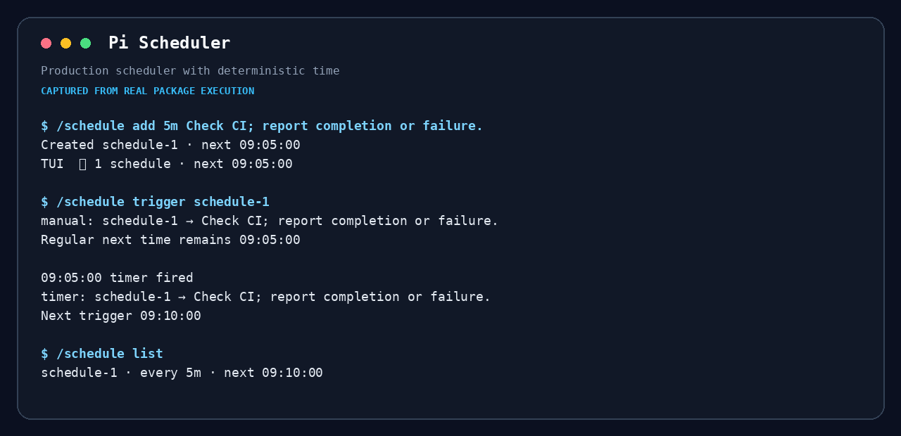
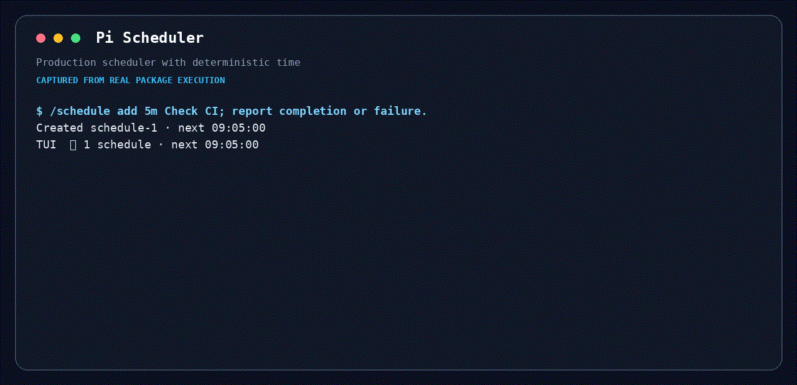

# Pi Scheduler

Session-scoped interval prompts for Pi. Scheduler does one thing: at a fixed interval, queue a prompt for the current main agent at a safe turn boundary.





## Why

Use Scheduler when the agent should periodically re-check CI, logs, a review, or another changing condition. It is not Cron, a background process manager, or a durable workflow engine.

## Install

```bash
pi install npm:@maxiaochao/pi-scheduler
```

Update it with `pi update npm:@maxiaochao/pi-scheduler`.

## Agent tool

```text
schedule({ action: "add", every: "5m", prompt: "Check CI; report completion or failure." })
schedule({ action: "list" })
schedule({ action: "trigger", id: "schedule-1" })
schedule({ action: "cancel", id: "schedule-1" })
```

## User command

```text
/schedule add 5m Check CI; report completion or failure.
/schedule list
/schedule trigger schedule-1
/schedule cancel schedule-1
```

Manual trigger queues one prompt and does not move the regular next time. The TUI status line shows the active count and next trigger.

## Semantics and limits

- Intervals accept `s`, `m`, `h`, and `d`, from 1 second through 7 days.
- Prompts use Pi `followUp`: an active agent turn finishes before the scheduled prompt runs.
- At most one prompt per schedule remains pending; missed intervals coalesce instead of flooding the queue.
- Schedules live only in the current session and are cleared on new/resume/fork/reload/quit.
- Cancel stops future timer events. Pi cannot selectively withdraw a prompt already in its follow-up queue.
- Timing is best-effort, not real-time. Recursive `setTimeout` uses absolute target times to avoid cumulative drift.
- Calendar expressions, time zones, persistence, process monitoring, and script notifications are intentionally out of scope.

## Remove

```bash
pi remove npm:@maxiaochao/pi-scheduler
```

Do not install both the standalone package and a toolkit release that already bundles Scheduler, or the tool and command will be registered twice.
