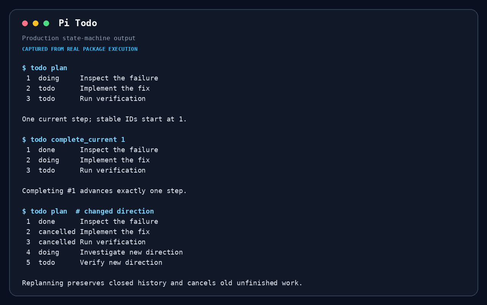
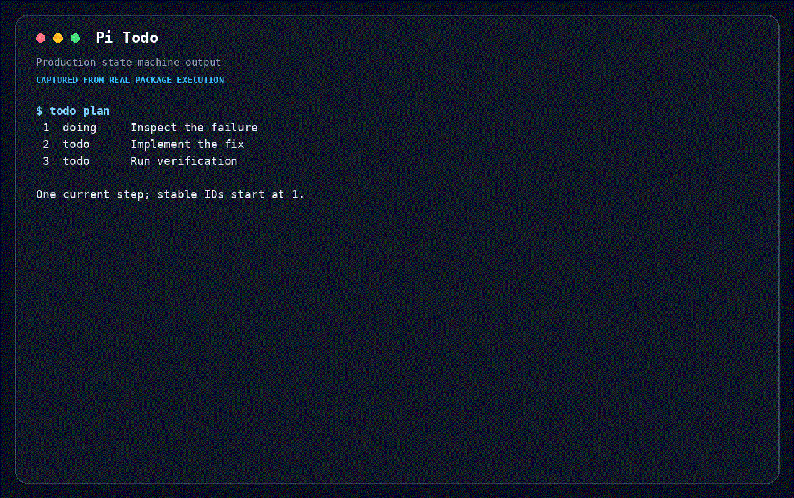

# @maxiaochao/pi-todo

Pi 的分支本地执行计划扩展，提供 `todo` 生命周期工具、只显示当前计划的 widget 和 `/todos` 完整历史视图。



## 为什么有这个包

这是 pi-toolkit 自研的计划执行模块，用明确状态替代只存在于对话文本里的计划。Todo 是用户可见的后续工作顺序，不是隐藏推理、完成报告或通用任务管理器。它解决改向后历史丢失、并发调用误完成、多个步骤同时 doing、完成后不推进，以及 UI 序号与持久 ID 混用的问题。

## 演示



```text
todo({ action: "plan", items: ["Inspect callers", "Implement", "Verify"] })
todo({ action: "complete_current", expected_current_id: 1 })
/todos
```

第一项实际完成后，下一项自动进入 `doing`。工具结果和 widget 只展示 `CURRENT plan`；`/todos` 展示当前分支的全部完成、取消和未完成历史。

## 安装

完整工具包已经包含本扩展：

```bash
pi install npm:@maxiaochao/pi-toolkit
```

只需要 todo 时单独安装：

```bash
pi install npm:@maxiaochao/pi-todo
```

两种方式二选一，避免重复注册。

## 更新

```bash
pi update npm:@maxiaochao/pi-toolkit  # 更新主包内置版本
pi update npm:@maxiaochao/pi-todo     # 更新独立子包
```

两个 npm 包版本独立。Todo 源码变更只有在发布新主包后才会到达主包用户，发布子包本身不会更新主包。

## 行为

- `plan(items)` 创建或重新规划。非空计划取消并保留全部旧 `doing`/`todo` 历史，保留已关闭历史，使用新的单调递增 ID，并启动第一步。
- `plan([])` 取消全部未完成工作，不留下当前计划；ID 不重置。
- `add_step(text)` 只追加一步。`complete_current` 和 `cancel_current` 必须携带匹配唯一 `doing` 步骤的 `expected_current_id`，否则原子失败；每次调用只推进一步。
- 调用共享可变状态并串行执行。同轮多个 sibling completion 不是支持的顺序机制。
- `list` 与每个变更都向模型返回简洁、规范的 `CURRENT plan`，包含稳定内部 ID 和状态；只有 `/todos` 显示完整历史。
- widget 从实时状态读取当前计划，使用连续显示位置、隐藏内部 ID 和关闭历史，并在计划结束时消失。

## 使用准则

- 只为明确的多步工作、确实分阶段的工作或跨模型交接创建计划；不要为简单单步任务创建计划。
- 仅在工作实际完成后调用 `complete_current`。仍然需要但被阻塞的步骤保持当前状态。
- `cancel_current` 表示当前步骤不再需要且后续计划仍有效；方向改变时使用 `plan`。
- 保留用户给出的步骤意图和顺序，只在可执行性要求下拆分步骤。
- 协议不提供任意更新、删除、清空、撤销、批量完成或 marker 文本解析。

## 开发与测试

权威源码位于 `extensions/` 和 `src/`。测试流程、用例和最近验证结果见 [TESTING.md](TESTING.md)。

```bash
npm --prefix packages/todo test
npm --prefix packages/todo run load-test
npm pack ./packages/todo --dry-run
```
