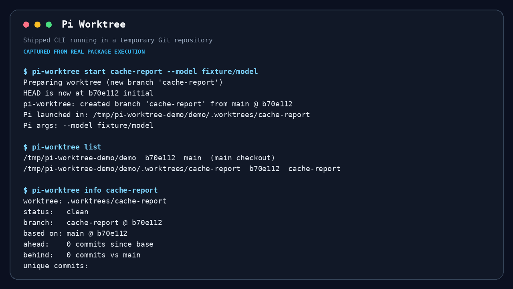
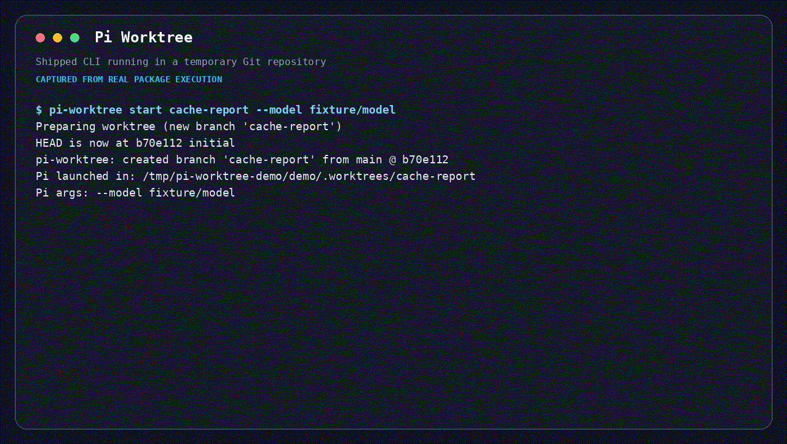

# @maxiaochao/pi-worktree

`pi-worktree` CLI、Pi Extension 与配套 skill。它既能启动独立 Pi，也能让用户或 Agent 在当前 Pi 界面中切换 worktree，并保留完整对话。



## 为什么有这个包

这个包把原来分散在主包中的 shell CLI、bash completion、安装逻辑和 agent skill 合成一个发布单元。它让人和 agent 使用同一套隔离流程，避免在主 checkout 中混入并行任务改动。

## 演示



```bash
pi-worktree start feature -p "implement the feature"
pi-worktree prepare --json feature
pi-worktree info feature
pi-worktree out
pi-worktree remove feature
```

`start` 从当前分支创建或复用 `.worktrees/feature`，记录 base，并在该目录启动 Pi。`prepare` 复用同一创建逻辑，但只返回目标，不启动嵌套 Pi。

在交互式 Pi 中，用户可以保留当前界面和完整对话：

```text
/worktree start feature
/worktree start feature --base main
```

命令会把当前持久会话 fork 到目标 worktree，再通过 Pi 的公开 session replacement API 切换。临时的 `--no-session` 会话无法使用此入口。

Agent 使用 Extension 注册的 `enter_worktree` tool。它创建或复用目标、终止当前工具轮，并在 `agent_settled` 后自动触发内部 `/worktree` 命令。Extension 随后执行 `SessionManager.forkFrom()` 和 `switchSession()`；目标 cwd 会写入新 session header，当前界面继续显示完整对话，重启后也仍然有效。整个流程由 Extension 完成，不需要外部 Harness 适配。

## 安装

完整工具包已经包含 CLI、Extension 和 skill：

```bash
pi install npm:@maxiaochao/pi-toolkit
```

只需要 worktree 能力时单独安装：

```bash
pi install npm:@maxiaochao/pi-worktree
```

postinstall 会把 CLI 复制到 `~/.local/bin/pi-worktree`，把 bash completion 安装到 `~/.local/share/bash-completion/completions/pi-worktree`。两种安装方式二选一。

## 更新

```bash
pi update npm:@maxiaochao/pi-toolkit  # 更新主包内置的 CLI 与 skill
pi update npm:@maxiaochao/pi-worktree # 更新独立子包
```

更新会重新运行安装逻辑并覆盖 `~/.local/bin/pi-worktree` 和 completion。主包与子包版本独立，不要同时安装。

## 命令

```bash
pi-worktree start <name> [pi args...]
pi-worktree prepare [--base <ref>] [--json] <name>
pi-worktree list
pi-worktree info <name>
pi-worktree out
pi-worktree remove <name>
pi-worktree prune
```

`prepare --json` 是 Extension 和其他宿主使用的幂等机器接口，返回 `created`、`attached`、`reused` 或 `already-active`，以及绝对路径、分支和 dirty 状态。已有 worktree 会复用；已存在但未挂载的同名分支会挂载；stale 注册、非法名称和路径冲突会显式失败。

Agent 用法见 `skills/pi-worktree/SKILL.md`。测试流程、夹具和结果见 [TESTING.md](TESTING.md)。
